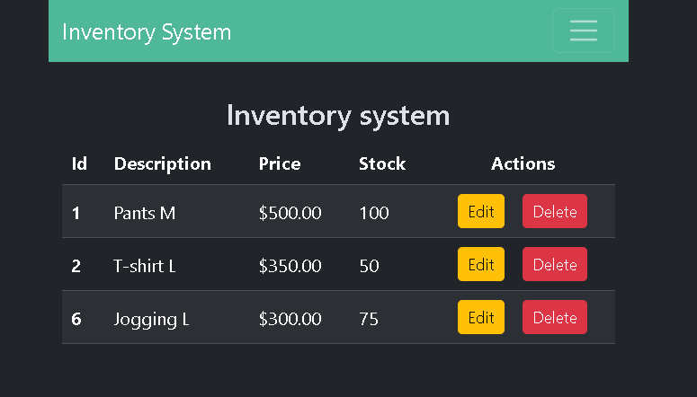
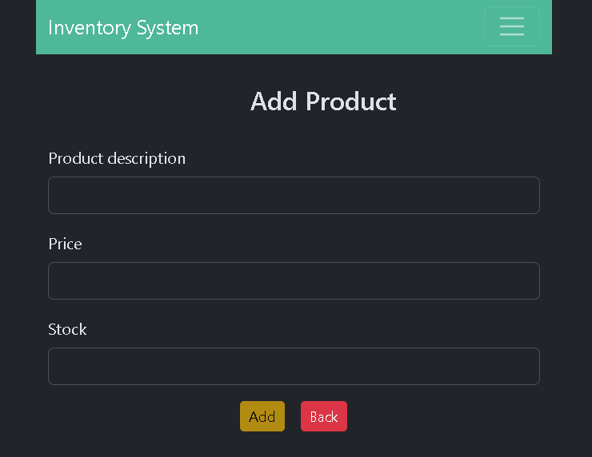

# 🗂️ Inventory Management App

A full-stack web application for managing products in an inventory system.  
The backend is built with **Spring Boot**, connected to a **MySQL** database for data persistence.  
The frontend is developed with **Angular**, providing a responsive interface for managing products.

---

## 🚀 Features

- Manage products with full **CRUD functionality** (Create, Read, Update, Delete).
- Form validation both on frontend and backend.
- Real-time synchronization with the database.
- Products displayed in a dynamic table with options to edit and delete.
- Responsive design using Bootstrap.

---

## 🛠️ Tech Stack

- **Frontend**: Angular, TypeScript, Bootstrap
- **Backend**: Spring Boot, Java 21, Spring Data JPA, Hibernate
- **Database**: MySQL
- **Build Tools**: Maven (backend), npm (frontend)

---

## 💻 Screenshots

### 🔸 Main Product List View


### 🔸 Create Or Update Product Form


---

## 🗂️ Project Structure

```bash
/inventory-app --> Backend (Spring Boot)
/inventory-ng --> Frontend (Angular)
/assets --> Screenshots for README
```
- The README.md file in each folder explains how to install and run the respective parts. You should run the backend first, then the frontend.
- Each README.md also explains how to view the corresponding documentation.

---

## 🔗 Database Configuration

The backend connects to a MySQL database.  
Connection settings are located in `inventory-app/src/main/resources/application.properties`:

```bash
spring.datasource.url=jdbc:mysql://localhost:3306/inventario_db?createDatabaseIfNotExist=true
spring.datasource.username=root
spring.datasource.password=admin
spring.jpa.hibernate.ddl-auto=update
spring.jpa.show-sql=true
```
- The database is created automatically if it doesn't exist.
- Initial test data is loaded from `data.sql` (optional).

---

## ✨ License
This project is for educational and portfolio purposes.
