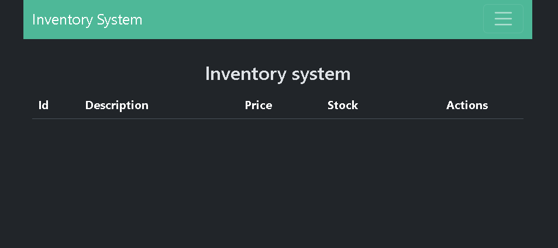

# 📦 Inventory NG (Frontend Angular)

This is the **frontend** of the Inventory Management System app, developed with **Angular**. It is designed to interact with the backend API to manage products in an inventory system.<br/>
It provides a user-friendly interface for performing CRUD operations on the product data stored in a MySQL database.<br/>
The frontend communicates with a Spring Boot REST API backend using HTTP requests. All CRUD operations performed from the interface are directly reflected in the database through the backend API.<br/>
The forms to add or update products includes real-time validation to ensure data integrity before submitting. Fields are validated both on the frontend (using Angular's form validators) and on the backend (with Java validation annotations) to ensure consistency.

---

## 🚀 Tech stack

- [Angular](https://angular.io/)
- [TypeScript](https://www.typescriptlang.org/)
- Bootstrap 
- Angular Router
- Form validation with `FormsModule`
- RxJS / HTTPClient (for API communication)

---

## 🔧 Installation and execution

1. Clone the repository and enter the frontend folder:

```bash
git clone https://github.com/EnzoWeimann/inventory-management-system.git
cd Inventory Management System\inventory-ng
```

2. Install dependencies:
```bash
npm install
```

3. Run the app:
```bash
ng serve -o
```
It should open the browser at http://localhost:4200.

If you can't see the products, the backend server needs to be started. See inventory-app/REAMDE.md.

If this is the case, you should see something like this:


---

## ✅ Form validations

The forms for adding and editing products include **frontend validations** equivalent to those defined in the backend (JPA):

| Field       | Validation                                      |
|-------------|-------------------------------------------------|
| Description | Required, minimum 2 characters, maximum 100     |
| Price       | Required, must be greater than or equal to 0    |
| Stock       | Required, must be an integer ≥ 0                |

If any field does not meet the validations, the **Add** button is disabled.  
Additionally, error messages are shown to the user when completing each field.

---

## 📁 Documentation

**Compodoc** was used to generate the code documentation.
You can view the comments in each file, or you can generate the corresponding documentation locally using:
```bash
npm run docs
```
This will serve the documentation at http://localhost:5500/documentation
